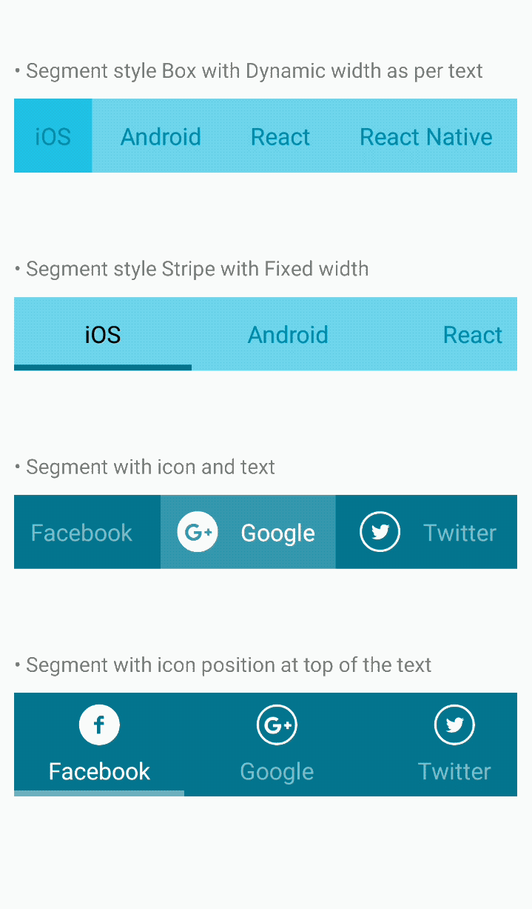

<h1>Introduction</h1>

INTUZ is presenting an interesting Segment Control to integrate inside your React Native based application. This component is an alternative of “SegmentedControlIOS” and providing extensive support for both Android and iOS platforms. Please follow below steps to integrate this control in your next project.

<br>
<h1>Features</h1>

- Segment view Text Only 
- Segment view with Image and Text 
- Pass text array and/or array of json object (Need to pass titleDisplayKey when use the json object for segment.)
- Segment with Horizontal scrolling
- Customize segment with your own style for Title (with selected and non selected options)
- Support for handling two different images- selected and non selected

<br>


<h1>Getting Started</h1>

> Import INTSegmentControl in your .js file

```
import INTSegmentControl from './app/component/INTSegmentControl';     
```

> Define your String array

```
var arrSegmentText =  ['iOS','Android','React','React Native','Facebook', 'Google', 'Twitter','Linked In'];
```

> Render INTSegmentControl

```
<INTSegmentControl controllStyle = {{height : 50, backgroundColor : '#74DDEE'}} 
          arrSegment ={arrSegmentText} 
          titleDisplayKey = 'title'             
          titleStyle = {{color:'#038EA5', fontSize : 16}}
          selectedSegmentColor = {'#2BCCE6'}
          onSelectionDidChange = {(selectedIndex) => {console.log('Selected Index ==' +  selectedIndex)}}
        />
```

> Define your Json array

```
 var arrSegment =  [{title:'Facebook',
                        icon:require('./app/images/top_heart_white.png'),
                        iconSelected:require('./app/images/top_heart_selected.png')},

                        {title:'Google',
                        icon:require('./app/images/top_heart_white.png'),
                        iconSelected:require('./app/images/top_heart_selected.png')},

                        {title:'Twitter',
                        icon:require('./app/images/top_heart_white.png'),
                        iconSelected:require(‘./app/images/top_heart_selected.png')}]
```

> Render INTSegmentControl

```
<INTSegmentControl controllStyle = {{height : 70, backgroundColor : '#057689'}} 
        arrSegment ={arrSegment} 
        titleDisplayKey = 'title'            
        isTextOnlySegment = {false}
        segmentWidthStyle = 'fixed' 
        segmentWidth = {345/3} 
        segmentIconPosition ='top'
        spaceBetweenIconAndTitle = {5}
        titleStyle = {{color:'#ffffff80', fontSize : 16}}
        titleStyleSelected = {{color:'#ffffff', fontSize : 16}}
        selectedSegmentColor = {'#ffffff40'}
        selectionStyle = 'stripe'// box || stripe
        stripeColor = '#ffffff70'
        stripHeight = {4}
        onSelectionDidChange = {(selectedIndex) => {console.log('Selected Index ===' +  selectedIndex)}}
        />
```
<br>
<h1>Properties</h1>

| Available properties 	| Type 	| Default Value 	| Required 	| Description 	|
|--------------------------	|-----------------------------------	|--------------------------------------------	|----------	|------------------------------------------------------------------------------------------------------------------------------------------------------------------------	|
| controllstyle 	| Style 	| { backgroundColor:'#702540', height:50,  } 	| No 	| Style your segment control 	|
| arrSegment 	| array 	| - 	| Yes 	| Array of string or json object to create segment 	|
| titleDisplayKey 	| String 	| - 	| Yes 	| Key from json object to display as title in segment control, when you pass array of json object. If you won't pass this value then segment title will not be displayed 	|
| isTextOnlySegment 	| Boolean (true/false) 	| - 	| No 	| True if you display title only segment and  false when you need image and title in segment 	|
| segmentWidthStyle 	| String (dynamic/fixed) 	| dynamic 	| No 	| Segment width style, Dynamic then it takes as per text length, Fixed then it displays we per assigned width  	|
| segmentWidth 	| Number 	| - 	| No 	| Pass the width of segment, It will be ignored when segmentWidthStyle is dynamic 	|
| segmentIconPosition 	| String (left, right, top, bottom) 	| left 	| No 	| Set your icon position align to the title 	|
| selectedIndex 	| Number 	| 0 	| No 	| Initial selected index 	|
| spaceBetweenSegment 	| Number 	| 5 	| No 	| Set the space between the two segment 	|
| spaceBetweenIconAndTitle 	| Number 	| 10 	| No 	| Set the space between the icon and title 	|
| segmentStyle 	| Style 	| - 	| No 	| Style of your segment 	|
| titleStyle 	| Style 	| { color:'white', fontSize:14 } 	| No 	| Title Style 	|
| titleStyleSelected 	| Style 	| - 	| No 	| Style will apply when segment is selected 	|
| selectedSegmentColor 	| String(color) 	| #ffffff40 	| No 	| Color of the selected segment 	|
| selectionStyle 	| String(box/stripe) 	| box 	| No 	| Selection style of selected segment 	|
| stripeColor 	| String(color) 	| white 	| No 	| Selection indicator color, Apply only when selectionStyle is stripe 	|
| stripeHeight 	| Number 	| 3 	| No 	| Selection indicator height, Apply only when selectionStyle is stripe 	|
| onSelectionDidChange 	| Function 	| - 	| No 	| Callback function when segment did change selection index 	|
<br>
<h1>Bugs and Feedback</h1>

For bugs, questions and discussions please use the Github Issues.

<br>
<h1>License</h1>

Copyright (c) 2018 Intuz Solutions Pvt Ltd.
<br><br>
Permission is hereby granted, free of charge, to any person obtaining a copy of this software and associated documentation files (the "Software"), to deal in the Software without restriction, including without limitation the rights to use, copy, modify, merge, publish, distribute, sublicense, and/or sell copies of the Software, and to permit persons to whom the Software is furnished to do so, subject to the following conditions:
<br><br>
THE SOFTWARE IS PROVIDED "AS IS", WITHOUT WARRANTY OF ANY KIND, EXPRESS OR IMPLIED, INCLUDING BUT NOT LIMITED TO THE WARRANTIES OF MERCHANTABILITY, FITNESS FOR A PARTICULAR PURPOSE AND NONINFRINGEMENT. IN NO EVENT SHALL THE AUTHORS OR COPYRIGHT HOLDERS BE LIABLE FOR ANY CLAIM, DAMAGES OR OTHER LIABILITY, WHETHER IN AN ACTION OF CONTRACT, TORT OR OTHERWISE, ARISING FROM, OUT OF OR IN CONNECTION WITH THE SOFTWARE OR THE USE OR OTHER DEALINGS IN THE SOFTWARE.

<h1></h1>
<a href="http://www.intuz.com">

</a>
